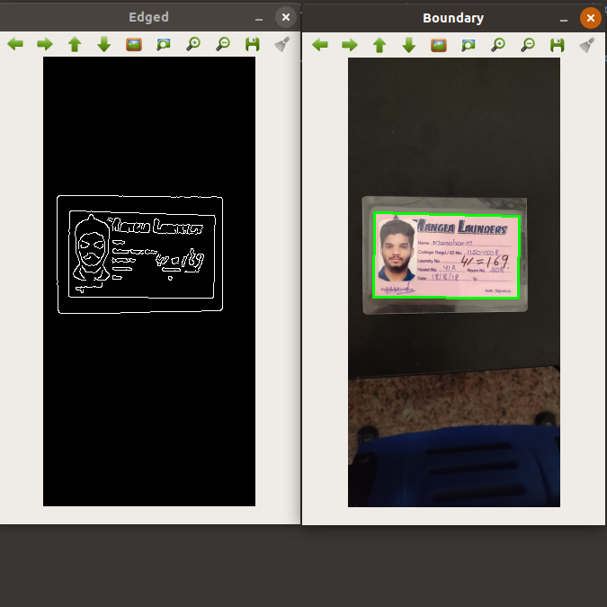
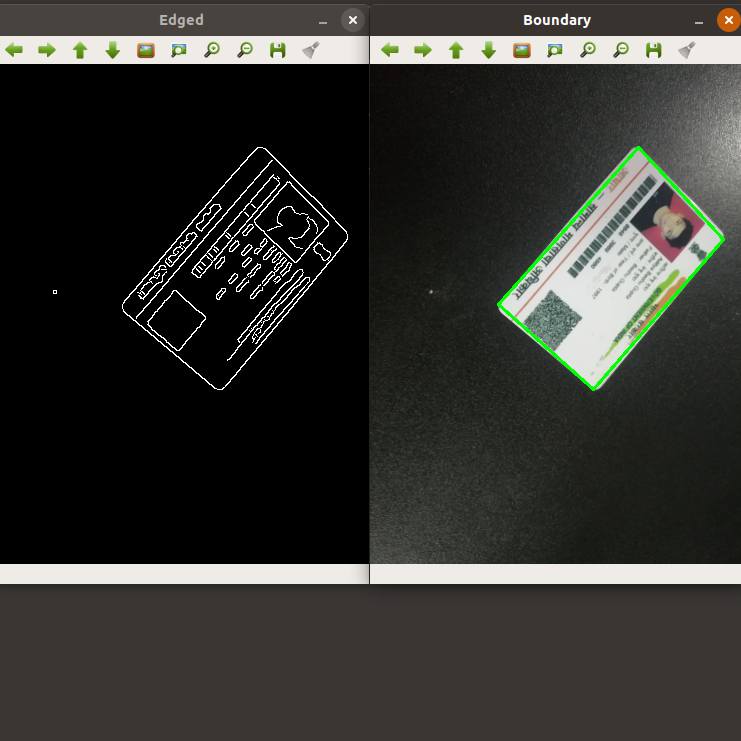
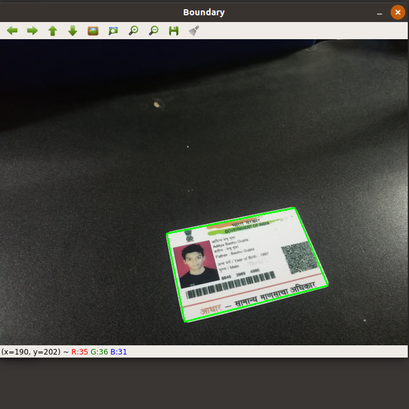
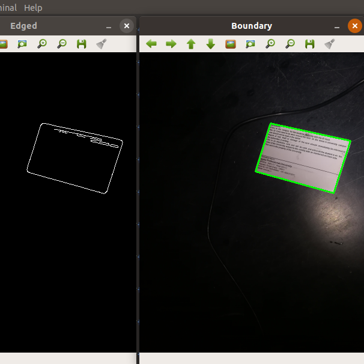
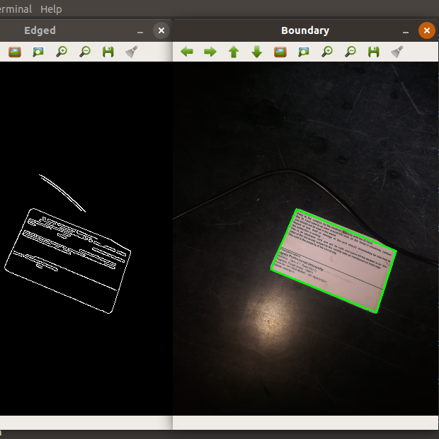

# Document-Boundary-Detection

Document Boundary &amp; Canny Edge Detection using OpenCV

* Used Simple OpenCV Library for Boundary and Edge Detection
* The Algorithm is quite fast and does not require any training and works quite well with rectangle documents as it was meant for document boundry detection 
* Did not use Deep Learning Techniques as it was most computationally expensive and required good Dataset of images with Boundry label and would had been slow too
* Sometimes simpler models are better than deep learning models

### How to Use

Make Sure you have following libraries installed

* opencv
* imutils

Use `pip install -r requirements.txt` to get all the dependencies

<b>To Run</b>

Use `python scan.py --image images/1.jpg ` to train the model

<b>It opens two windows one with edge detection and one with boundary detection</b>

## Samples
 
 
 
 
 
 

### Credits & Inspired By
(1) https://www.pyimagesearch.com/2014/09/01/build-kick-ass-mobile-document-scanner-just-5-minutes/ 